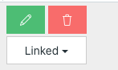

# sameButtonConfirmSnippet
confirm action without popup




Just add .confirm class to the button for the action.

```javascript
$(document).ready(function($){
	$('.confirm').click(function( event ) {
		el_clicked = $(this).data('clicked');
		if(el_clicked==1){
			$(this).html($(this).data('old_title'));
			$(this).removeClass('clicked');
			$(this).data('clicked',2);
			$(this).trigger('click');
		}else{
			if(el_clicked!=1&&el_clicked!=2){
				event.preventDefault();
				$(this).data('clicked',1);
				$(this).data('old_title',$(this).html());
				$(this).addClass('clicked');
				$(this).text('Sure?');
			}else{
				$(this).data('clicked',0);
			}
		}

	});
});
```
